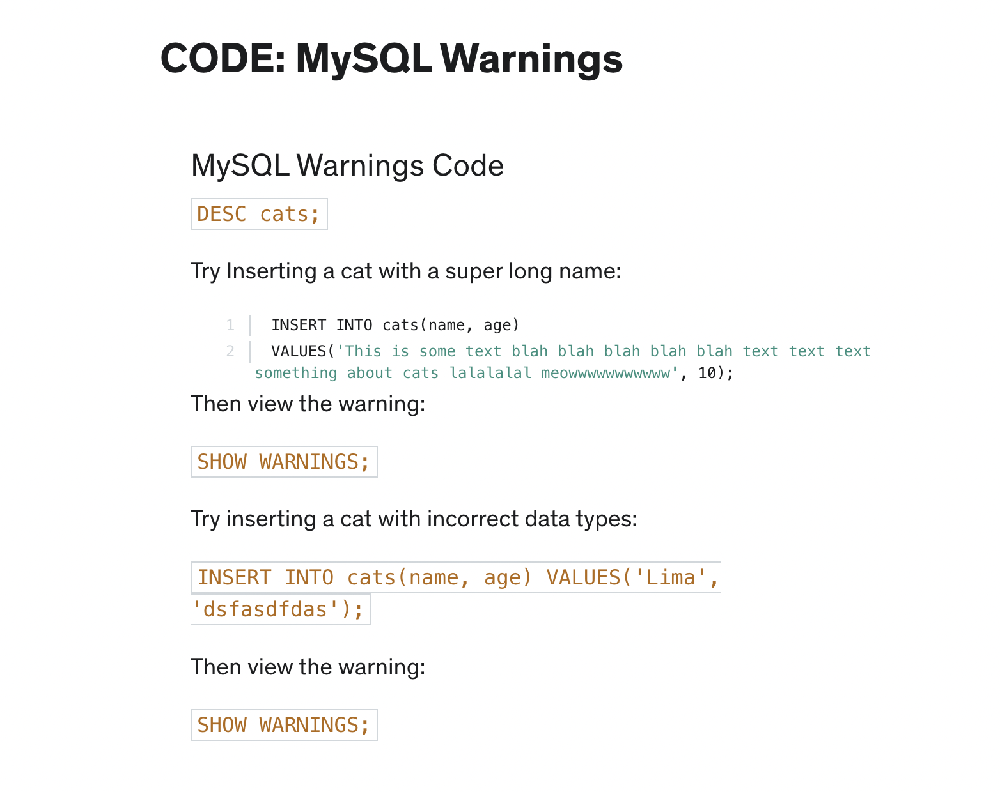

# Insert Data into a table

1. Create a cats_db.
2. Create a cats table.
3. Insert some values in cats table.

code:

```
mysql-ctl cli;

CREATE DATABASE cats_db;

SHOW DATABASES;

USE cats_db;

CREATE TABLE cats(name VARCHAR(40), age INT);

SHOW TABLES;

DESC cats;
// or
SHOW COLUMNS FROM cats;

INSERT INTO cats(name, age)
VALUES ('blue', 4);

INSERT INTO cats(age, name)
VALUES (7, 'draco');
```

### How to see inserted data in a table:

Quick intro to **'SELECT'**

```
SELECT * FROM cats;
```

### Inserting multiple values in DB:

```
INSERT INTO cats(name, age)
VALUES ('blue', 21),
        ('philip', 10),
        ('gray', 4);
```

# Insert Challenge

Create a people database with first_name, last_name, age columns

```
CREATE TABLE people(first_name VARCHAR(20), last_name VARCHAR(20), age INT);

SHOW TABLES;

DESC people;
// or
SHOW COLUMNS FROM people;

INSERT INTO people(first_name, last_name, age)
VALUES('Akash', 'More', 23);

INSERT INTO people(age, first_name, last_name)
VALUES(13, 'Tina', 'Belcher'),
      (42, 'Bob', 'Belcher');

INSERT INTO people(first_name, last_name, age)
VALUES('Linda', 'Belcher', 45),
VALUES('Philip', 'Frond', 38),
VALUES('Calvin', 'Fischoder', 70);
```

#### If you're wondering how to insert a string (VARCHAR) value that contains quotations, then here's how.

You can do it a couple of ways:

1. Escape the quotes with a backslash: "This text has \"quotes\" in it" or 'This text has \'quotes\' in it'
2. Alternate single and double quotes: "This text has 'quotes' in it" or 'This text has "quotes" in it'

### Warning in Databases:



# NULL ans NOT NULL

Create a cat2 table with name and age cannot be null, if we don't pass any value

```
CREATE TABLE cats2(name VARCHAR(40) NOT NULL, age INT NOT NULL);

INSERT INTO cats2(name)
VALUES('Manya');

// 👆This gives warning because age cannot be null and we are passing only age.
// This was not issue earlier where we did not specifically applied NOT NULL to name and age.
// INSERT INTO cats()
// VALUES();
// This is valid syntax for cats table where both name and age of this cat is NULL.
```

# Setting DEFAULT value:

CODE: Setting Default Values
Define a table with a DEFAULT name specified:

```
CREATE TABLE cats3
  (
    name VARCHAR(20) DEFAULT 'no name provided',
    age INT DEFAULT 99
  );
```

Notice the change when you describe the table:

```
DESC cats3;
```

Insert a cat without a name:

```
INSERT INTO cats3(age) VALUES(13);
```

Or a nameless, ageless cat:

```
INSERT INTO cats3() VALUES();
```

### Combine NOT NULL and DEFAULT:

```
CREATE TABLE cats4
(
name VARCHAR(20) NOT NULL DEFAULT 'unnamed',
age INT NOT NULL DEFAULT 99
);
```

Notice The Difference:

```
INSERT INTO cats() VALUES();

SELECT * FROM cats;

INSERT INTO cats3() VALUES();

SELECT * FROM cats3;

INSERT INTO cats3(name, age) VALUES('Montana', NULL);

SELECT * FROM cats3;

INSERT INTO cats4(name, age) VALUES('Cali', NULL);
```

# Primary Keys

CODE: Primary Keys
Define a table with a PRIMARY KEY constraint:

```
CREATE TABLE unique_cats
  (
    cat_id INT NOT NULL,
    name VARCHAR(100),
    age INT,
    PRIMARY KEY (cat_id)
  );
DESC unique_cats;

Insert some new cats:

INSERT INTO unique_cats(cat_id, name, age) VALUES(1, 'Fred', 23);

INSERT INTO unique_cats(cat_id, name, age) VALUES(2, 'Louise', 3);

INSERT INTO unique_cats(cat_id, name, age) VALUES(1, 'James', 3);
Notice what happens:

SELECT * FROM unique_cats;
```

Adding in AUTO_INCREMENT:

```
CREATE TABLE unique_cats2 (
    cat_id INT NOT NULL AUTO_INCREMENT,
    name VARCHAR(100),
    age INT,
    PRIMARY KEY (cat_id)
);
INSERT a couple new cats:

INSERT INTO unique_cats2(name, age) VALUES('Skippy', 4);
INSERT INTO unique_cats2(name, age) VALUES('Jiff', 3);
INSERT INTO unique_cats2(name, age) VALUES('Jiff', 3);
INSERT INTO unique_cats2(name, age) VALUES('Jiff', 3);
INSERT INTO unique_cats2(name, age) VALUES('Skippy', 4);
Notice the difference:

SELECT * FROM unique_cats2;
```
