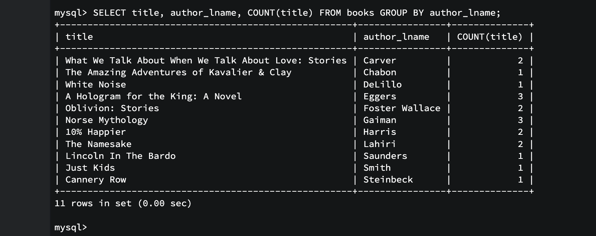

# **Agregate Functions**

These functions are used to aggregate data and find meaning in it

# Count Function

```
SELECT COUNT(*) FROM books;
```

👆 Returns all the books from books table

**QUE:** Return how many authors present in books table:

```
SELECT COUNT(DISTINCT author_fname, author_lname) as 'all authors' FROM books;
```

**QUE:** Return how many titles contain 'the' in them

```
SELECT COUNT(title) FROM books WHERE title LIKE '%the%';
```

# Group By

In group by, we group by certain records.
Supossigly in author_lname column 1 author has multiple books then we group all books written by same author
Query for above is

```
SELECT title, author_lname, COUNT(title) FROM books GROUP BY author_lname;
```

👆Output is:


**QUE:** Print number of books written by each author

```
SELECT
    CONCAT(author_fname, ' ', author_lname) AS Author,
    COUNT(title) AS 'No of Nooks'
    FROM books
    GROUP BY author_fname, author_lname;
```

**QUE:** Print number of books released in each year(years in ascending order)

```
SELECT
    released_year, COUNT(title)
    FROM books
    GROUP BY released_year
    ORDER BY released_year;
```

# Min and Max

Min and Max is applied on numbers
It returns Max or Min number of perticular column

**QUE:** Find latest year book is released

```
SELECT MAX(released_year) FROM books;
```

**Using Min-Max with subqueries:**

**QUE:** Find title of the books with most pages(Find biggest book)

```
SELECT title, pages
    FROM books
    where pages = ( SELECT MAX(pages)
                    FROM books
                );
```

It is recommneded to use sort over subqueries as subqueries can perform slowly

**QUE:** Find year each author published their first book

```
SELECT
    CONCAT(author_fname, ' ', author_lname) as Author,
    MIN(released_year) AS 'First Book'
    FROM books
    GROUP BY author_fname, author_lname
    ORDER BY released_year;
```

# The Sum Function

Sum function gives sum of all numbers in columns

**QUE:** Find all number of pages of all books in table

```
SELECT SUM(pages) FROM books;
```

**QUE:** Find numbers of pages written by each author

```
SELECT
    CONCAT(author_fname, ' ', author_lname) as Author,
    SUM(pages) AS pages
    FROM books
    GROUP BY author_fname, author_lname;
```

# Avg Function

AVG function gives average of all numbers in columns
Average returns decimal with 4 decimal points

**QUE:** Find average stock value of books for each year in ascending order

```
SELECT
    released_year, AVG(stock_quantity)
    FROM books
    GROUP BY released_year
    ORDER BY released_year ASC;
```

**QUE:** Find average book size for each author

```
SELECT
    CONCAT(author_fname, ' ', author_lname),
    AVG(pages)
    FROM books
    GROUP BY author_fname, author_lname
    ORDER BY AVG(pages)
```
