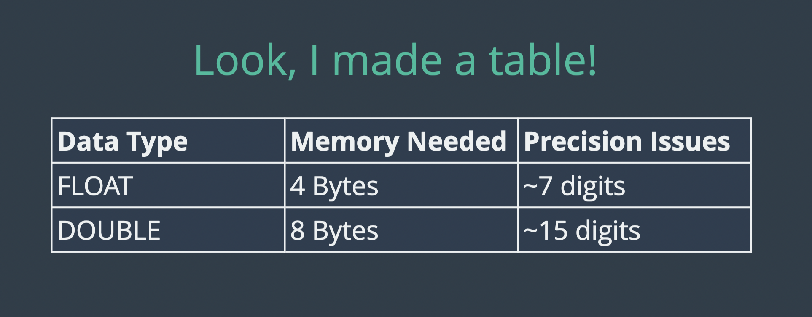

# CHAR and VARCHAR

1. CHAR has a fixed length.
2. VARCHAR is a bit more flexible.
3. If we have a variable of type CHAR with 4 characters, we every variable will have 4 length.
4. If we pass value more than 4, it will be truncated to 4 and if we pass less value than 4 extra spaces will be added until length is 4.
5. VARCHAR is dynamic, if we assign length 4 to varchar, and assign value less than 4 then unlike CHAR spaces will not be added.
6. Use CHAR when you know exact length of character for every variable. e.g. (yes/no) : y (or) n -> only 1 character.

# DECIMAL

```
CREATE TABLE items (
    price DECIMAL(7,4)
);
```

1. In above case maximum number of character for price is going to be 7.
2. There will be 4 decimals characters in this number.
3. So maximum number that can be saved in price is 999.9999
4. DECIMAL is used for precision.
5. If we insert very large number more than 999.9999 (in this case), mamixum value is automatically added to price i.e 999.9999
6. Also if there are more than 4 decimals then value will be rounded upto 4 decimals.
7. e.g. 6.99999999 will become 7.0000

# FLOAT and DOUBLE

1. Difference between FLOAT, DOUBLE and DECIMAL are quite technical and how they are stored in memory
2. FLOAT and DOUBLE can stored larger numbers with lesser memory compared to DECIMAL.
3. But this is compromised by pricision.
4. DECIMAL take more space than FLOAT or DOUBLE but it is very accurate.
5. While Float occupy less space but not accurate. Float is not precise after 7 character digits.
6. DOUBLE is not precise after 15 character digits.

```
CREATE TABLE thingies (price FLOAT);

INSERT INTO thingies(price) VALUES (88.45);

SELECT * FROM thingies;

INSERT INTO thingies(price) VALUES (8877.45);

SELECT * FROM thingies;

INSERT INTO thingies(price) VALUES (8877665544.45);

SELECT * FROM thingies;
```



# DATE, TIME, DATETIME

Format for DATETIME is 'yyyy-mm-dd hh:mm:ss'

```
CREATE TABLE people (name VARCHAR(100), birthdate DATE, birthtime TIME, birthdt DATETIME);

INSERT INTO people (name, birthdate, birthtime, birthdt)
VALUES('Padma', '1983-11-11', '10:07:35', '1983-11-11 10:07:35');

INSERT INTO people (name, birthdate, birthtime, birthdt)
VALUES('Larry', '1943-12-25', '04:10:42', '1943-12-25 04:10:42');

SELECT * FROM people;
```

# CURDATE(), CURTIME(), NOW()

1. CURDATE() - gives current date
2. CURTIME() - gives current time
3. NOW() - gives current datetime

```
INSERT INTO user(name, birthdate, birthtime, birthdt)
values("Vishwesh", CURDATE(), CURTIME(), NOW());
```

# Formatting Dates

1. DAY() gives day in number

```
SELECT name, DAY(birthdate) from user;
```

👆return 30 in my case, cause my birthday is 30th oct

2. DAYNAME() gives sunday, monday.... etc

```
SELECT name, birthdate, DAYNAME(birthdate) FROM user;
```

returns:

| name     | birthdate  | DAYNAME(birthdate) |
| -------- | ---------- | ------------------ |
| Akash    | 1998-10-30 | Friday             |
| Vishwesh | 1998-10-09 | Friday             |

3. DAYOFWEEK() gives number of day in a week (sunday is 1, saturday is 7)

4.DAYOFYEAR() gives number of day in year. (1 january is 1, 31 dec is 365)

**_These functions can be applied on both DATE and DATETIME datatypes._**

4. HOUR() gives hour
5. MINUTE() gives minute
6. HOUR() and MINUTE() acn be applied on TIME and DATETIME datatypes.
7. Always refer mysql documentation for this
   `https://dev.mysql.com/doc/refman/8.0/en/date-and-time-type-syntax.html`
8. We have DATE_FORMAT() function we pass date to it and a string of special character as second argument for format in which we want date

```
SELECT DATE_FORMAT(birthdt, 'Was born on a %W') FROM people;

SELECT DATE_FORMAT(birthdt, '%m/%d/%Y') FROM people;

SELECT DATE_FORMAT(birthdt, '%m/%d/%Y at %h:%i') FROM people;
```

# **_DATE ARITHMATIC_**

# DATEDIFF()

1. used to find different between to datetimes.
2. It gives number of in between days.

```
SELECT DATEDIFF(now(), birthdt) FROM user;
```

# DATE_ADD(<datetime>, INTERVAL <'duration in month, year... minutes etc'>)

Interval used to sepecify how much we want to add in datetime

```
SELECT name, birthdt, DATE_ADD(birthdt, INTERVAL 4 MONTH) FROM user;
```

# Add, Substract datetime

Instead of using DATE_ADD(), we can use `+` or `-` in datetime.

```
SELECT birthdt, birthdt - INTERVAL 1 MONTH from user;

SELECT birthdt, birthdt - INTERVAL 1 MONTH + INTERVAL 1 YEAR  from user;
```

# Working with timestamps

used for string current datetime, (created at or updated at)

```
CREATE TABLE comments (
    content VARCHAR(100),
    created_at TIMESTAMP DEFAULT NOW()
);

INSERT INTO comments (content) VALUES('lol what a funny article');

INSERT INTO comments (content) VALUES('I found this offensive');

INSERT INTO comments (content) VALUES('Ifasfsadfsadfsad');

SELECT * FROM comments ORDER BY created_at DESC;

CREATE TABLE comments2 (
    content VARCHAR(100),
    changed_at TIMESTAMP DEFAULT NOW() ON UPDATE CURRENT_TIMESTAMP
);

INSERT INTO comments2 (content) VALUES('dasdasdasd');

INSERT INTO comments2 (content) VALUES('lololololo');

INSERT INTO comments2 (content) VALUES('I LIKE CATS AND DOGS');

UPDATE comments2 SET content='THIS IS NOT GIBBERISH' WHERE content='dasdasdasd';

SELECT * FROM comments2;

SELECT * FROM comments2 ORDER BY changed_at;

CREATE TABLE comments2 (
    content VARCHAR(100),
    changed_at TIMESTAMP DEFAULT NOW() ON UPDATE NOW()
);
```

# Challenges

QUE: What is good use case for CHAR?
We use CHAR when we know exact string length.
e.g yes/no questions: 'y' or 'n'

QUE: Create table inventory

```
CREATE TABLE inventory(
    item_name VARCHAR(40),
    price DECIMAL(8,2),
    quantity INT
);
```

QUE: Difference between DATETIME, TIMESTAMP

1. They both store date and time.
2. TIMESTAMP have much smaller range compared to DATETIME.
3. DATETIME takes more space roughly twice as much as TIMESTAMP
4. We use TIMESTAMP for storing metadata of when something is created or updated.

QUE: Print current time:

```
SELECT CURTIME();
```

QUE: Print current Date:

```
SELECT CURDATE();
```

QUE: Print current day of week

```
SELECT DAYOFWEEK(NOW());
```

QUE: Print current day and time using mm/dd/yyyy format

```
SELECT DATE_FORMAT(NOW(), '%m/%d/%Y');
```

<!-- QUE: Print current date and time using this format 'January 2, at 3.15'

```
SELECT CONCAT(MONTHNAME(NOW()), ' ',DAY(NOW()), ', ', 'at ', HOUR(NOW()), '.', MINUTE(NOW()));
```

QUE: Create a tweets table

```
CREATE TABLE tweets(
    tweet_content VARCHAR(100),
    user_name VARCHAR(20),
    created_at TIMESTAMP DEFAULT NOW()
);
``` -->
