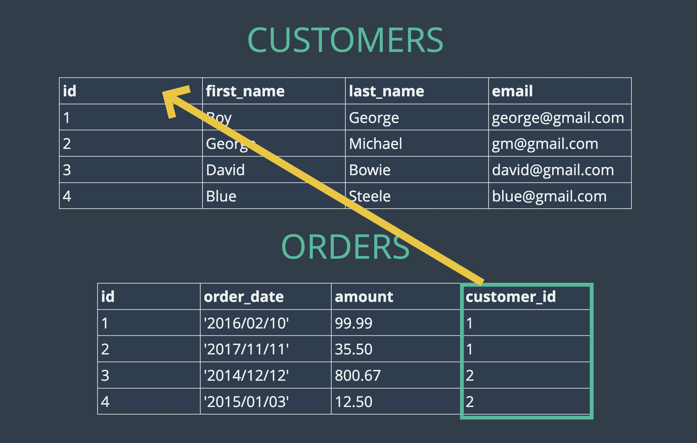
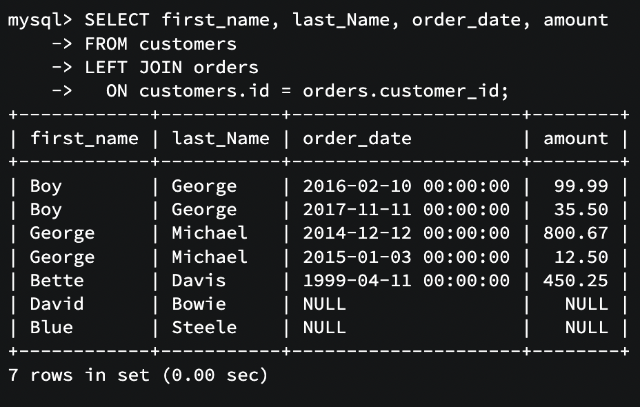

## Real world data can be messy

# Relationships basics

1. One to one relationship
2. One to many relationship
3. Many to many relationship

# Maintaining data in two tables



# Foreign key

In below example customer_id is a foreign key

```
CREATE TABLE customers(
    id INT PRIMARY KEY AUTO_INCREMENT NOT NULL,
    first_name VARCHAR(40),
    last_name VARCHAR(40),
    email VARCHAR(40)
);

CREATE TABLE orders(
    id INT AUTO_INCREMENT PRIMARY KEY NOT NULL,
    order_date DATETIME,
    amount DECIMAL(8, 2),
    customer_id INT,
    FOREIGN KEY(customer_id) REFERENCES customers(id)
);
```

# Cross Join

## Finding Orders Placed By George: 2 Step Process

```
SELECT id FROM customers WHERE last_name='George';
SELECT * FROM orders WHERE customer_id = 1;
```

## Finding Orders Placed By George: Using a subquery

```
SELECT * FROM orders WHERE customer_id =
(
SELECT id FROM customers
WHERE last_name='George'
);
```

## Cross Join Craziness

In cross join, every record of first table is mapped to every record of second table.

```
SELECT * FROM customers, orders;
```

# Inner Join

## IMPLICIT INNER JOIN

```
SELECT * FROM customers, orders
WHERE customers.id = orders.customer_id;
```

## IMPLICIT INNER JOIN

SELECT first_name, last_name, order_date, amount
FROM customers, orders
WHERE customers.id = orders.customer_id;

## EXPLICIT INNER JOINS

```
SELECT * FROM customers
JOIN orders
ON customers.id = orders.customer_id;
```

```
SELECT first_name, last_name, order_date, amount
FROM customers
JOIN orders
ON customers.id = orders.customer_id;
```

```
SELECT *
FROM orders
JOIN customers
ON customers.id = orders.customer_id;
```

## ARBITRARY JOIN - meaningless, but still possible

```
SELECT * FROM customers
JOIN orders ON customers.id = orders.id;
```

# LEFT JOIN

```
SELECT first_name, last_Name, order_date, amount
FROM customers
LEFT JOIN orders
  ON customers.id = orders.customer_id;
```

This will return



We can have default value for null, with **IFNULL**

```
SELECT
    first_name,
    last_name,
    IFNULL(SUM(amount), 0) AS total_spent
FROM customers
LEFT JOIN orders
    ON customers.id = orders.customer_id
GROUP BY customers.id
ORDER BY total_spent;
```

# RIGHT JOIN

1. Right Join is similar to left join
2. If we apply left join on cutstomer(reverse order of joining) and apply right join, it is exactly like left join in baove example
